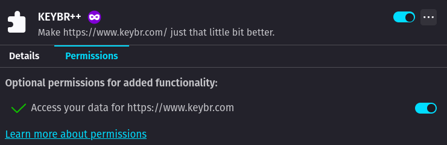

# kEYBR++

Make <https://www.keybr.com/> just that little bit better.

## Installation

### Firefox

_The FireFox version is currently self-hosted due to the Addon store's strict requirements on store_
_page descriptions._

[Download Keybr++ for FireFox](https://github.com/WillsterJohnson/keybr-plusplus/releases/latest/download/keybrpp.xpi)

After installing, go to [about:addons](about:addons) and find Keybr++ in the list of extensions.

Click on the three dots and select "manage".

Select the "Permissions" tab and enable "Access your data for https://www.keybr.com/".

_Keybr++ will never send your data over the internet for any reason without explicit and_
_well-informed permission from you._

### Chrome

[Download Keybr++ for Chrome](https://chrome.google.com/webstore/detail/keybr%20%20/ijkdbamaapabgbaeddolmdconghnhnbi)

## Features

Everything Keybr++ does, sorted from newest to eldest.

### Homepage Stats

As of v0.2.0

- adds a stats section to the homepage displaying daily and all-time stats for
  average & best WPM, accuracy, and number of lessons completed

### Capslock Indicator

As of v0.1.0

- adds a capslock indicator to the keyboard
